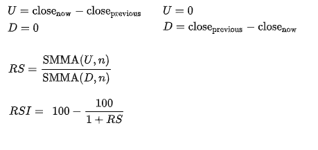
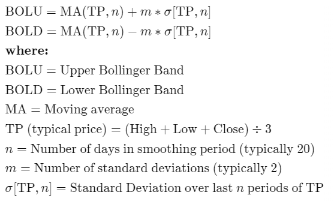

# Задание 2
**ноутбук с работой** - [task2](https://github.com/alkomarova/math_modeling/blob/task2/task2.ipynb)
### Цель:
Выработка рекомендаций поведений трейдера на основе паттернов и индикаторов

### Задачи: 
1. Выбрать исследуемые технические индикаторы 
2. Реализовать алгоритм предсказания цен акций компаний
в зависимости от значения выбранного технического индикатора

### Используемые методы/подходы/данные: 
* В качестве технического индикатора выбран **Индекс относительной силы**(*RSI*):

* В качестве дополнительного технического индикатора были выбраны **Полосы Бойлинджера**(*Bollinger Bands*)е:

n,m - варьируемые параметры, которые были оптимизированы в результате выполнения работы

* В качестве [датасета](https://github.com/alkomarova/math_modeling/blob/task2/data/ebay.us.txt) были
выбраны цены на акции компании "Ebay" за период с 1998 до 2017г.
* Для построения предсказательной модели использовалась линейная регрессия

### В ходе работы:
1. Был реализован алгоритм предсказания значения цены акции компании "EBAY" на основе
значений технического индикатора с помощью линейной регрессии
2. Были подобраны оптимальные параметры для коэффициентов в формулах для расчета 
Upper/Lower Bollinger Bands
3. Была показана зависимость значения ошибки модели от количества дней, для которых
строятся предсказания

### Заключение: 
В результате работы удалось реализовать алгоритм предсказания значения цены акции компании "EBAY"
на третий день с наилучшими значениями метрик: 
* MSE = 1.4845
* MAE = 0.8952
* R^2 = 0.9472 

которые были достигнуты при n = 20, m = 4. \
Также было показано, что при увеличении окна предсказания, растет ошибка модели. 
