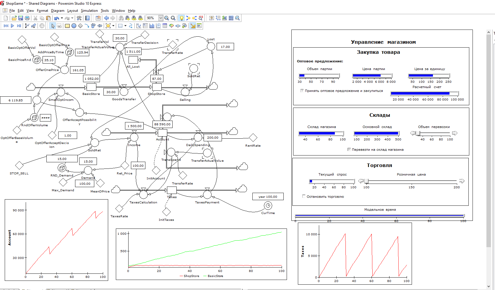

# Цель работы:
Знакомство с системно-динамическим программированием

# Задачи:
- Добавить новый уровень в модель
- Преобразовать модель в код Python

# Описание:
В исходную модель был добавлен уровень подсчета налоговой базы и суммы накопленных налоговых задолженностей 
с последующим вычетом налога со счета. 
- Реализация в PowerSim Studio:

# Заключение
В исходную модель магазина был добавлен уровень, отвечающий за расчет налогов.
Данная модель была преобразована в код на языке Python.
