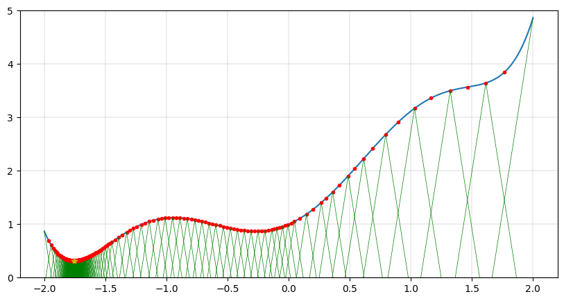

# Цель работы:
Знакомство с методом Пиявского

# Задачи:
- Реализовать метод Пиявского на языке Python
- Сравнить на выбранной функции работу модели из Excel и реализованного метода

# Описание:
В качестве минимизируемой функции выбрана следующая:

$$f(x,y) = 2x^2-1.05x^4+x^6/6+xy+y^2$$ 
в которой фиксируем $y=1$ и получаем 

$$f(x) = 2x^2-1.05x^4+x^6/6+x+1$$

Отрезок для поиска минимума: $[-2, 2]$

Точность $eps =0.001$

- Визуализация реализованного метода

# Заключение
Реализован метод Пиявского на языке Python
