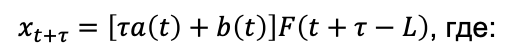

# Цель работы:
Знакомство с моделью Хольта-Уинтерса

# Задачи:
- Реализовать модель Хольта-Уинтерса
- Подобрать наилучшие параметры для выбранных данных

# Описание:

Модель Хольта-Уинтерса включает три уравнения для обновления уровня, тренда и сезонной компоненты, что позволяет учитывать тренд и сезонность при прогнозировании временных рядов.

# Заключение
Была реализована модель Хольта-Уинтерса на языке python, а также были подобраны наилучшие параметры с помощью библиотеки scipy.
